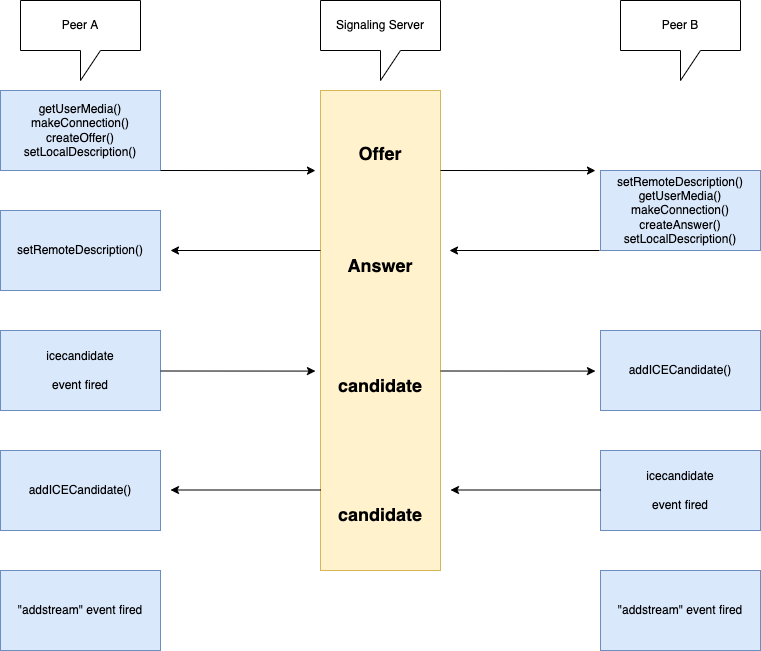

[목차로이동](https://github.com/JJongTaeng/webrtc-docs)

# WebRTC 소개
- 중개자 없이 브라우저 간에 임의의 데이터를 교환할 수 있도록 하는 기술입니다.
- 오디오 및/또는 비디오 미디어 또한 교환할 수 있습니다.
- WebRTC를 구성하는 일련의 표준들은 플러그인이나 제 3자 소프트웨어 설치 없이 종단 간 데이터 공유와 화상 회의를 가능하게 합니다.

# 비디오, 오디오 데이터 교환 예제

- 위 이미지 처럼 Signaling Server를 통해 각 설정 정보를 주고 받아서 연결을 시도합니다.
- 연결 완료 이후에는 peer-to-peer 통신이 가능합니다.
- 첫번째로 자신의 stream 정보를 호출합니다. (`mediaDevices`는 크롬에서 https에서만 지원됩니다.)
    ```typescript
      const myStream = await navigator.mediaDevices.getUserMedia({ audio: true, video: true});
    ```
- 연결정보를 생성합니다.
    ```typescript
      const myPeerConnection = new RTCPeerConnection();
    ```
- offer를 생성하고, localDescription을 설정 후 Signaling Server로 전달합니다.
    ```typescript
      const offer = await myPeerConnection.createOffer();
      myPeerConnection.setLocalDescription(offer);
      // offer 서버로 전송..
    ```
- 서버에서는 다른 Peer 브라우저 B에게 `offer`를 전송합니다.
- 브라우저 B또한 A와 같이 `myStream`과 `myPeerConnection`을 생성했습니다.
- 브라우저 B는 `offer` 데이터를 받아서 `remoteDescription`을 설정해줍니다. 또 `answer`을 생성해서 `localDescription`에 설정하고, 브라우저 A에게 `answer`을 전달합니다.
    ```typescript
      myPeerConnection.setRemoteDescription(offer);
      const answer = await myPeerConnection.createAnswer();
      myPeerConnection.setLocalDescription(answer);
      // answer 서버로 전송
    ```
- answer을 받은 브라우저 A는 `remoteDescription`에 `answer`을 설정합니다.
    ```typescript
      myPeerConnection.setRemoteDescription(answer);
    ```
- 상호 offer, answer을 주고받은 브라우저는 icecandidate 이벤트가 발생합니다.
- 일반적으로 로컬에서 RTCPeerConnection.setLocalDescription()을 호출한 후에 발생합니다. 몇가지 이벤트 또한 발생합니다.
- RTCPeerConnection을 생성할 때 icecandidate 이벤트를 등록하여, 발생된 ice 값을 상호 브라우저에게 전달하여 addICECandidate()로 설정합니다.
    ```typescript
      function makeConnection() { // makeConnection은 모든 브라우저에서 호출
        myPeerConnection = new RTCPeerConnection();
        myPeerConnection.addEventListener('icecandidate', (data) => {
          // data.candidate 값을 상호 브라우저에게 전송
        });
      }
  
      // 데이터 수신
      myPeerConnection.addIceCandidate(ice);
    ```
- `track` 이벤트를 추가하여, 다른 브라우저의 stream 정보를 받아올 수 있습니다.
- 새로운 인바운드 트랙이 연결에 추가되고 addTrack을 호출하면 트랙 이벤트를 수신합니다. 실제로 확인 시에는 `remoteDescription`에 `answer` 또는 `offer`를 설정할 때 발생합니다.
- track event는 `offer`, `answer`에 오디오와 비디오 두개의 track이 설정되면 각각의 track을 이벤트 콜백의 인자로 받습니다.
    ```typescript
        function makeConnection() { // makeConnection은 모든 브라우저에서 호출
          myPeerConnection = new RTCPeerConnection();
          myPeerConnection.addEventListener('track', (track) => {
            const video = document.createElement("video");
            video.srcObject = track.streams[0];
          });
          myStream.getTracks().forEach(track => {
            myPeerConnection.addTrack(track, myStream)
          });
        } 
    ```
- 여기까지 오면 상대방의 stream과 나의 stream을 브라우저에서 확인할 수 있습니다.
---
